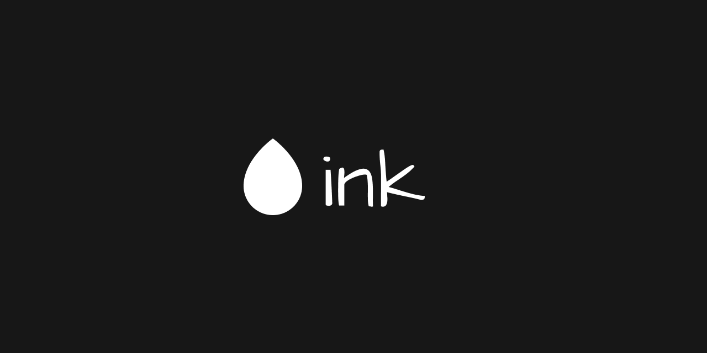

# Ink

[![Build][build-badge]][build]
[![License][license-badge]][license]
[![Discord][discord-badge]][discord]

An open-source drawing application and party game for the browser.

## Built with...
![TypeScript][ts-badge]
![Next JS][next-badge]
![TailwindCSS][tailwind-badge]
![NodeJS][node-badge]
![Socket.io][socket-badge]
![DigitalOcean][ocean-badge]

[ts-badge]: https://img.shields.io/badge/typescript-%23007ACC.svg?style=for-the-badge&logo=typescript&logoColor=white
[next-badge]: https://img.shields.io/badge/Next-black?style=for-the-badge&logo=next.js&logoColor=white
[tailwind-badge]: https://img.shields.io/badge/tailwindcss-%2338B2AC.svg?style=for-the-badge&logo=tailwind-css&logoColor=white
[node-badge]: https://img.shields.io/badge/node.js-6DA55F?style=for-the-badge&logo=node.js&logoColor=white
[socket-badge]: https://img.shields.io/badge/Socket.io-black?style=for-the-badge&logo=socket.io&badgeColor=010101
[ocean-badge]: https://img.shields.io/badge/DigitalOcean-%230167ff.svg?style=for-the-badge&logo=digitalOcean&logoColor=white
[build]: https://circleci.com/gh/draw-dot-ink/ink/tree/master
[build-badge]: https://img.shields.io/github/workflow/status/draw-dot-ink/ink/tests?event=push
[license-badge]: 
  https://img.shields.io/badge/License-MIT-yellow.svg
[license]: https://opensource.org/licenses/MIT
[discord-badge]: https://img.shields.io/discord/925112411835469825.svg?color=7389D8&labelColor=6A7EC2&logo=discord&logoColor=ffffff
[discord]: https://discord.gg/6Vj8eBUJnH